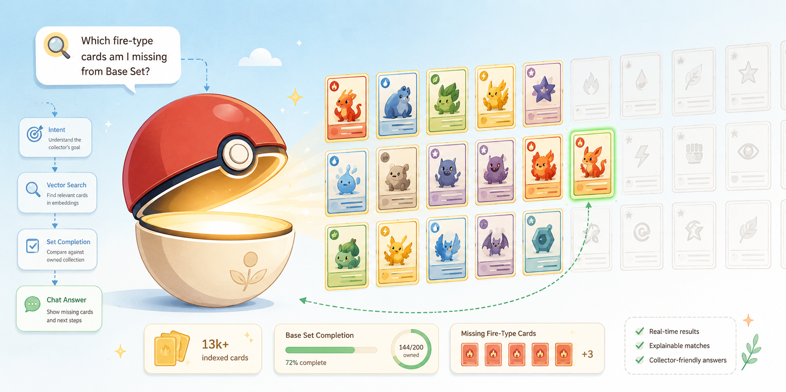

# PokéTracker

<p align="center">
  
</p>


I have a real Pokémon TCG collection, a kid who plays with me, and a spreadsheet that stopped scaling about two thousand cards ago. PokéTracker is what I built instead — a full-stack collection tracker with an AI chat assistant, running on Supabase Edge Functions and a React frontend, that we actually use to figure out what's missing from Base Set and which binder a given Charizard lives in.

It started as a quick Express + SQLite prototype on Railway (still in `backend/`, kept for the git history — it's dead code now, fully superseded). The version that's actually deployed is the one described below: Supabase Postgres with pgvector, Deno edge functions, and a proper auth system built for an account a 10-year-old can log into without an email address.

---

## What it does

- **10 ways to browse a collection** — Dashboard, My Cards, Pokédex, By Set, By Series, By Starter, By Type, By Evolution Stage, Missing Cards, Duplicates
- **An AI chat assistant with a real RAG pipeline** — ask "what fire type cards do I own?" or "which sets am I closest to completing?" in plain English, backed by semantic search over an indexed corpus of the Pokémon TCG API's full card catalog (13k+ cards and growing)
- **Voice input** — Web Speech API wired directly into the chat box
- **Camera capture** *(experimental)* — snaps a photo and attaches it to a chat message; honest caveat: the LLM behind it is text-only, so this is currently more "attach a picture" than "identify this card from a photo"
- **Batch add mode** — browse a whole set, series, or type and check off owned cards in bulk
- **Foil tier tracking** — Normal, Reverse Holo, Holofoil, 1st Edition Normal, and 1st Edition Holofoil, tracked per card
- **Set completion tracking** — progress bars and missing-card lists per set, with a chat-driven "which sets am I closest to finishing?" view across the whole collection
- **PIN-based accounts built for kids** — no email required to log in, COPPA-compliant by design (see below)
- **Admin dashboard** — LLM usage metrics, latency/token stats, full chat log, intent-frequency breakdown, feedback review, user management
- **JSON export** — full collection backup, one click

*(A JSON import endpoint exists server-side and was used for the original data migration, but there's no import button in the UI yet — noted as a next step, not a claimed feature.)*

---

## Tech Stack

| Layer | Technology |
|---|---|
| Frontend | React 18 + TypeScript + Vite, deployed on Vercel |
| Backend | Supabase Edge Functions (Deno/TypeScript) |
| Database | Supabase Postgres + pgvector, HNSW cosine index |
| AI / LLM | Ollama Cloud (`gemma4:31b-cloud`, OpenAI-compatible API) |
| Embeddings | `gte-small` via Supabase AI (384 dimensions) |
| Auth | Supabase Auth, wrapped in a username + PIN flow (details below) |
| Transactional email | SendGrid (account confirmation, PIN reset) |
| Card data | [Pokémon TCG API](https://pokemontcg.io) |
| CI/CD | GitHub Actions → Supabase auto-deploy (5 of 6 functions; see caveat below) |

---

## The part I'm proudest of: PIN auth for a kid who doesn't have an email

The user base for this app is exactly one Pokémon-obsessed child, and I wasn't going to ask a 10-year-old to manage an email address and a password. So the auth flow does something a little unusual:

1. On registration, the child (or I, as the parent) picks a **username** and a **6-digit PIN**. A parent email is required, but it's never shown to the app or used to log in.
2. The edge function maps the username to a synthetic internal email (`username@pokemontracker.app`) and calls Supabase's admin API to create a real auth user with the PIN as the password.
3. Login exchanges username + PIN for that synthetic email + password via `signInWithPassword`, which hands back a genuine Supabase session JWT — so from that point on, everything (RLS policies, edge function auth checks) works exactly like normal Supabase Auth. The synthetic-email trick is purely a translation layer at the door.
4. Forgot your PIN? Supabase's own `generateLink` recovery flow issues a signed reset link, delivered by email (to the parent, for child accounts) via SendGrid.

It's paired with a real `/privacy` page that spells out COPPA compliance in plain language: parent-provided email only, no PII collected from the child, no ads, no third-party tracking, and a stated 30-day window to review/delete data on request.

---

## How the AI Chat Works (RAG Pipeline)

```
User query
    │
    ▼
Intent detection (11 types via regex — owned_search, set_completion, all_sets,
    filter_type, filter_supertype, filter_subtype, filter_rarity, foil,
    duplicates, region, general)
    │
    ▼
Embed query with gte-small (same model used at ingest time)
    │
    ▼
Route to a specialized Postgres RPC function
    ├─ match_owned_cards()        ← semantic search scoped to your cards
    ├─ match_cards()               ← global search across the full indexed catalog
    ├─ get_set_completion()        ← "what's missing from Base Set?"
    ├─ get_all_set_completion()    ← "which sets am I closest to finishing?"
    ├─ collection_by_filter()      ← "fire type rares", "Stage 2 Pokémon"
    ├─ get_collection_with_foil()  ← "1st edition cards"
    ├─ get_tradeable_cards()       ← "what duplicates can I trade?"
    └─ get_collection_by_region()  ← "my Kanto cards" (by national Pokédex range)
    │
    ▼
Build context (retrieved cards + collection summary + current page context)
    │
    ▼
Call LLM (gemma4 31B via Ollama Cloud)
    │
    ▼
Stream reply → log intent, latency, token usage → render card images inline
```

A small detail I like: intent detection runs duplicate-checking *before* ownership checking, specifically because "what extra copies do I have?" would otherwise get misclassified as a plain `owned_search` — the regex order in `detectIntent()` encodes a real disambiguation decision, not just a list of patterns.

**Ingestion** runs on a weekly GitHub Actions cron (`ingest-check`, Mondays 06:00 UTC): it compares the Pokémon TCG API's current set list against what's indexed, and if anything's missing or incomplete, kicks off `ingest-cards` — a self-invoking fan-out job that processes 10 cards per invocation, embeds them, upserts into `cards_vectors`, and recursively re-triggers itself for the next page until the whole catalog is caught up. It's idempotent per page via an `ingest_queue` table, so a failed run just picks back up.

---

## Project Structure

```
pokemon-tracker/
├── supabase/
│   ├── config.toml
│   ├── migrations/                 # Postgres schema: collection, profiles, cards_vectors,
│   │                                #   chat_logs, chat_feedback, general_feedback, RPCs
│   └── functions/
│       ├── _shared/                # CORS helpers, Supabase client factory (service/anon/user)
│       ├── auth/                   # Username+PIN register/login/forgot-pin, SendGrid email
│       ├── collection/             # CRUD + import/export, RLS-scoped to auth.uid()
│       ├── cards/                  # TCG API proxy with set/card cache
│       ├── chat/                   # RAG pipeline + LLM call + feedback endpoint
│       ├── admin/                  # Admin metrics + user management RPCs
│       ├── ingest-cards/           # Self-invoking fan-out embedding pipeline
│       └── ingest-check/           # Weekly incremental sync (triggered by cron)
├── frontend/
│   └── src/
│       ├── components/             # ChatModal, BatchAddModal, SearchAddModal, CardGrid, NavBar, …
│       ├── contexts/                # AuthContext (session, profile, login/register/logout)
│       ├── hooks/                  # useCollection, useCards (TanStack Query)
│       ├── pages/                   # Dashboard, MyCards, Pokedex, BySet, BySeries, ByStarter,
│       │                            #   ByType, ByEvolutionStage, MissingCards, Duplicates, Admin,
│       │                            #   Login, Register, ForgotPin, ResetPin, PrivacyPolicy
│       ├── types/
│       └── utils/
│           └── api.ts               # Axios client → Supabase edge functions
├── scripts/
│   └── migrate-collection.ts       # One-time JSON → Supabase import (used during the auth migration)
├── backend/                         # Legacy Express/SQLite prototype (Railway). Not deployed,
│                                     #   not referenced by anything current — kept for history only.
└── .github/workflows/
    ├── supabase-deploy.yml         # Auto-deploys 6 of 7 functions on push to main (see note below)
    ├── ingest-check.yml            # Weekly card-catalog sync
    └── supabase-keepalive.yml      # Pings every 3 days (free-tier anti-pause)
```

---

## Local Development

### Prerequisites

- Node 20+
- [Supabase CLI](https://supabase.com/docs/guides/cli)

### Frontend

```bash
cd frontend
npm install
cp .env.example .env
npm run dev
```

`.env` needs three variables — the checked-in `.env.example` currently only documents one, so here's the full set:
```env
VITE_API_URL=https://<your-project-ref>.supabase.co
VITE_SUPABASE_URL=https://<your-project-ref>.supabase.co
VITE_SUPABASE_ANON_KEY=<your-anon-key>
```

### Edge Functions

```bash
supabase start
supabase functions serve
```

---

## Deployment

### 1. Link your Supabase project

```bash
supabase login
supabase link --project-ref <your-project-ref>
```

### 2. Push the database schema

```bash
supabase db push
```

### 3. Deploy edge functions

```bash
supabase functions deploy auth         --no-verify-jwt
supabase functions deploy collection   --no-verify-jwt
supabase functions deploy cards        --no-verify-jwt
supabase functions deploy chat         --no-verify-jwt
supabase functions deploy admin        --no-verify-jwt
supabase functions deploy ingest-cards --no-verify-jwt
supabase functions deploy ingest-check --no-verify-jwt
```

**Note:** the GitHub Actions deploy workflow (`supabase-deploy.yml`) auto-deploys `collection`, `cards`, `chat`, `admin`, `ingest-cards`, and `ingest-check` on every push to `main` — but not `auth`. Changes to the auth function currently need a manual `supabase functions deploy auth` after the first push.

### 4. Set edge function secrets

In the [Supabase Dashboard → Edge Functions → Secrets](https://supabase.com/dashboard):

| Secret | Description |
|---|---|
| `POKEMON_TCG_API_KEY` | [pokemontcg.io](https://pokemontcg.io) API key |
| `OLLAMA_CLOUD_URL` | Ollama Cloud base URL |
| `OLLAMA_CLOUD_TOKEN` | Ollama Cloud bearer token |
| `OLLAMA_CLOUD_MODEL` | e.g. `gemma4:31b-cloud` |
| `SENDGRID_API_KEY` | SendGrid API key — sends registration and PIN-reset emails |
| `SENDGRID_FROM_EMAIL` | Verified sender address for the above |
| `ALLOWED_ORIGIN` | Your frontend origin (falls back to `*` if unset — fine for local dev only) |

`SUPABASE_URL` and `SUPABASE_SERVICE_ROLE_KEY` are injected automatically.

### 5. Set GitHub Actions secrets

| Secret | Where |
|---|---|
| `SUPABASE_ACCESS_TOKEN` | supabase.com → Account → Access Tokens |
| `SUPABASE_DB_PASSWORD` | Supabase Dashboard → Project Settings → Database |
| `SUPABASE_SERVICE_ROLE_KEY` | Used by the weekly `ingest-check` workflow to call the edge function directly |

### 6. Trigger initial card ingestion

```bash
curl -X POST https://<your-project-ref>.supabase.co/functions/v1/ingest-cards \
  -H "Content-Type: application/json" \
  -d '{"page": 1}'
```

This fans out automatically across all pages of the Pokémon TCG API (10 cards per invocation, self-triggering). Monitor progress in Table Editor → `ingest_queue`.

---

## Known Quirks

- **Edge runtime URL stripping** — Supabase strips `/functions/v1` from `req.url` inside a deployed function but not locally. Every function's path parsing has to account for both `/functions/v1/<slug>/...` and `/<slug>/...`.
- **"Resend" comment, SendGrid code** — the auth function's email helpers are commented as `// Email helpers (Resend)` but actually call SendGrid's REST API. A naming holdover from an earlier draft that never got cleaned up — harmless, but a good reminder to keep comments in sync with reality.
- **Free tier anti-pause** — `supabase-keepalive.yml` pings the project every 3 days to prevent Supabase from pausing an inactive free-tier project.
- **Embedding model parity** — both ingestion and query-time embedding use `gte-small`. Swapping models means re-ingesting all indexed cards.
- **The `backend/` folder is not deployed** — it's the original Railway/Express prototype, kept only for history. Nothing in the current frontend or Supabase functions references it.
